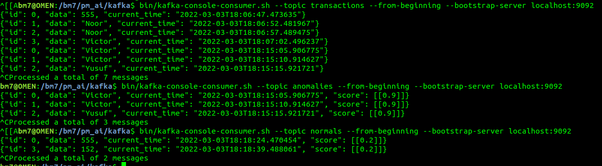

# Predictive-maintenance
Predictive maintenance using ML, hosted by FastAPI and Kafka

# Settings
Try to clone the repo.

```
git clone https://github.com/bm777/predictive-maintenance.git
```

#### 0. Set up the kafka env

```
cd kafka
bin/zookeeper-server-start.sh config/zookeeper.properties
bin/kafka-server-start.sh config/server.properties
```

#### 1. Create the transactions, anomalies and normals topics in Kafka Consumer

```
cd kafka
bin/kafka-topics.sh --create --topic transactions --bootstrap-server localhost:9092
bin/kafka-topics.sh --create --topic anomalies --bootstrap-server localhost:9092
bin/kafka-topics.sh --create --topic normals --bootstrap-server localhost:9092
```

We can check our created topics by this command `kafka-topics.sh --bootstrap-server localhost:9092 --list`, the result should be three topics.


#### 2. Start the predictive maintenance process

- run the Process

```
python streaming_kafka/predictive_maintenance.py
```

- [optional] watch the topic of your choice {`transactions`, `anomalies`, and `normals` } in the consumer

```
bin/kafka-console-consumer.sh --topic transactions --from-beginning --bootstrap-server localhost:9092
bin/kafka-console-consumer.sh --topic anomalies --from-beginning --bootstrap-server localhost:9092
bin/kafka-console-consumer.sh --topic normals --from-beginning --bootstrap-server localhost:9092
```


#### 3. Start the producer (from our distributed users)

- static producer

```
python streaming_kafka/producer.py
```

- Dynamic producer: using REST FastAPI (building)
  - POST
 ```
http://localhost:5500/<event>
 ```
 
#### 4. Alerts bot to slack (building...)
